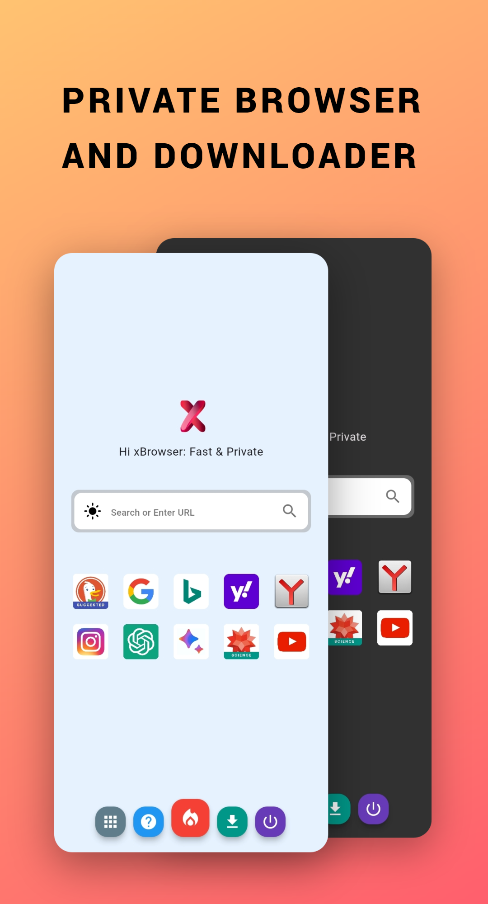
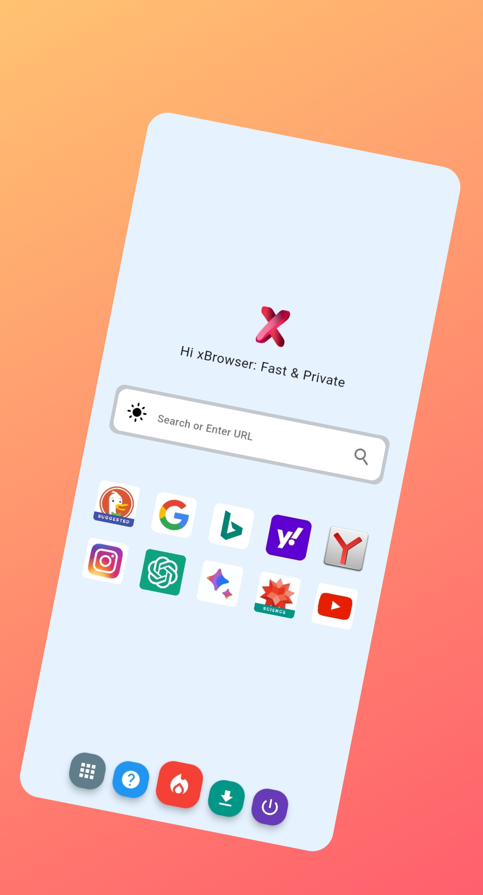

# Hi xBrowser: Fast & Private

Welcome to Hi X Browser, where privacy meets simplicity. Our browser is designed with one primary focus: to ensure your browsing history remains completely private. Say goodbye to the worry of your browsing habits being tracked or stored. With Hi X Browser, your online activities are your business and yours alone.

**Features:**

1. 🕵️‍♂️ **No History Tracking**: Unlike traditional browsers, Hi X Browser does not store any browsing history. Your online activities are never recorded or tracked, providing you with complete privacy and peace of mind.

2. 🚀 **Lightweight and Fast**: Experience lightning-fast browsing speeds without the burden of history storage. Hi X Browser is optimized for speed and efficiency, ensuring a seamless browsing experience every time.

3. 🔒 **Secure Browsing**: Enjoy secure browsing sessions with built-in privacy features. Hi X Browser automatically blocks trackers and ensures your data remains protected from prying eyes.

4. 🌐 **Anonymous Search**: Utilize the integrated search engine without the fear of your search history being stored. Hi X Browser ensures that your searches remain anonymous and confidential.

5. 📱 **Cross-Platform Compatibility**: Access Hi X Browser seamlessly across multiple devices. Whether you're browsing on your desktop, laptop, or mobile device, enjoy consistent privacy protection everywhere you go.

6. 🎨 **Customizable Interface**: Tailor the browser to suit your preferences with customizable themes and settings. Personalize your browsing experience while maintaining your privacy.

7. 📡 **VPN Integration**: For an additional layer of privacy, Hi X Browser offers seamless integration with VPN services. Safeguard your online identity and protect your data from potential threats.

8. 🛑 **Ad Blocker**: Say goodbye to annoying ads and pop-ups with Hi X Browser's built-in ad blocker. Enjoy a cleaner, distraction-free browsing experience without compromising your privacy.

9. 🔄 **Automatic Session Clearing**: Hi X Browser automatically clears your session data upon exiting the app, ensuring no traces of your browsing activity are left behind.

10. 🌐 **Support for Private Browsing Modes**: Hi X Browser supports private browsing modes for websites that require it, providing an extra layer of privacy when needed.

**Why Choose Hi X Browser?**

Hi X Browser empowers you to take control of your online privacy without sacrificing speed or convenience. With a commitment to transparency and security, we prioritize your privacy above all else. Join the millions of users who trust Hi X Browser for a private and secure browsing experience.

**Get Started Today**

Download Hi X Browser now and experience the freedom of browsing without boundaries. Say hello to privacy, say hello to Hi X Browser.
